# Spun

*Spotify Wrapped, but it lives on your iPod.*

Written by Siebe Majoor ([@majorsiebe](https://github.com/majorsiebe), AKA rabarber man) — last updated 23-07-2026

**Contains spoilers!** Parts of this plugin are meant to be discovered. The spoiler-heavy bits below are collapsed — expand them at your own risk.

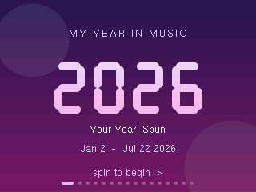

> **DISCLAIMER:** I am NOT a C dev, I am a Food Tech student. This project was built with significant help from Claude (AI) and I barely understand most of the technical details. You are free to do with the source code as you please, but if you break something, you keep both pieces, and I will not be held responsible.
>
> This plugin was built and tested for/on the iPod Classic 6th and 7th gen. I currently do not plan on porting it to other generations or devices that run Rockbox, so do not bother asking, you will be ignored. You are welcome to attempt it yourself, and I will be happy to try and merge it, but do not automatically expect a response.

With that out of the way, let me show you some of the features!

## What this is and why it exists

You are looking at a Rockbox plugin that tracks what you listen to and presents it in a nice way **on the device itself**, instead of needing a computer to check and parse your log. It is inspired by Spotify Wrapped, but has some features I have never seen done like this before.

I got the idea shortly after switching fully to iPods for music and wondering just how much I actually listened. A couple of afternoons of thinking later, a basic version of this came out. It has since been expanded significantly, but instead of wasting your time explaining it in unnecessary detail, let me show you the features.

Put simply, the plugin reads Rockbox's already-existing `playback.log` file and presents it in such a way that normal people can read it. If you already have logging enabled, the plugin will show your stats immediately, with some limitations (more on that in [Known Limitations and Bugs](#known-limitations-and-bugs)). If you don't, **Spun has nothing to read and every card will be empty** — see [Enabling logging](#enabling-logging-required), it takes one minute.

## Features

As of writing this, the deck includes:

- A nice start screen showing stats for the current year
- Time listened, in minutes and hours
- Tracks played
- Top artists
- Top songs
- Top albums
- A listening clock graph, which shows you when you listen most
- **The 3am Club** — a card showing how much you listen at night (between midnight and 5 AM)
- A skip report (what it does is self-explanatory)
- Top 5 songs that have never been skipped
- Top 5 songs you used to listen to, but not anymore
- **Your Year So Far** — a year overview sorted by week, showing how far along the current year is, with a bar of every week at a glance. Includes SUPERWEEKs and ULTRAWEEKs (explained below). Can be expanded to get a short summary of a single week!
- A year overview as a heatmap, showing how much you listen on a given day with a coloured square — similar to the GitHub contributions heatmap
- A **Listening Type** card — there are 16 different ones to collect!
- The **Achievements** tab. This really is its own thing, see below.
- A final card with your year at a glance — nice for sharing, contains less information than the year overviews

<b>Click to see all 16 cards</b> (spoilers, obviously)

| | |
|---|---|
| 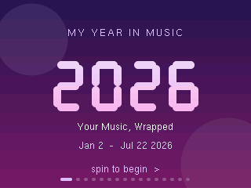 | 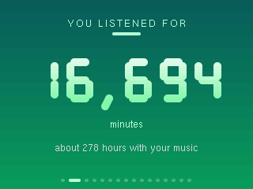 |
| 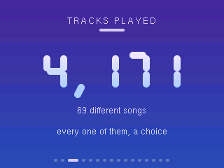 | 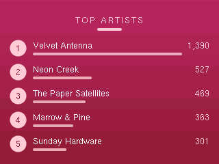 |
| 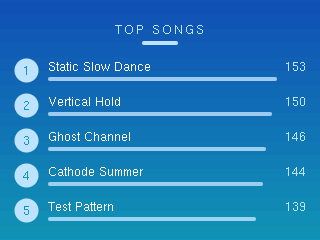 | 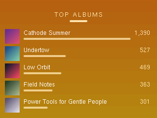 |
| 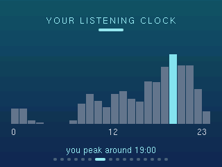 | 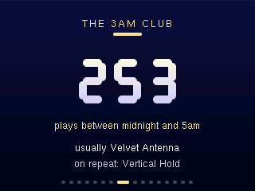 |
| 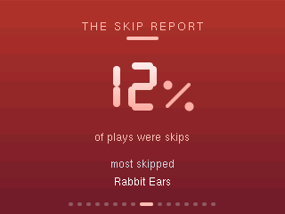 | 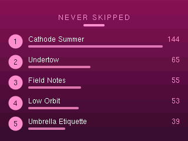 |
| 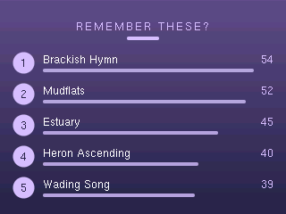 | 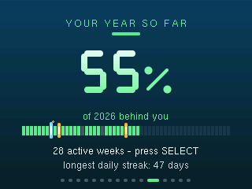 |
| 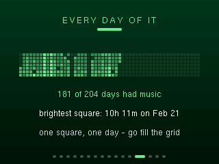 | 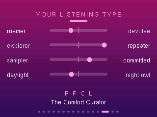 |
| 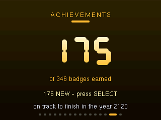 | 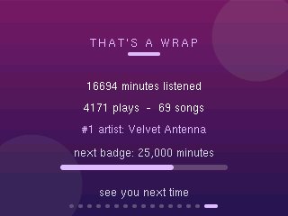 |

## The non-standard cards, explained

### Your Year So Far

The year overview shows the current year, broken up into calendar weeks. Pressing SELECT highlights the year bar and allows you to scroll between weeks.

- Weeks without activity show up as light grey; weeks yet to come are a transparent grey.
- Weeks with activity are green, gold or blue, corresponding to a normal week, a **SUPERWEEK** or an **ULTRAWEEK**:

| Week type | Listening time | Colour |
|---|---|---|
| Normal week | 1 – 1439 minutes | green |
| SUPERWEEK | 24+ hours (1440+ min) | gold |
| ULTRAWEEK | 48+ hours (2880+ min) | blue |

When a week is highlighted, hitting SELECT again opens a card showing that week in more detail: a small time-played counter (similar to the Minutes Listened card), top artist, top song, and total plays and skips. If the week is a SUPERWEEK or ULTRAWEEK, the card is highlighted in gold or blue. Pressing MENU goes back to the year overview; if the bar is still selected, pressing MENU again returns to scrolling between cards.

### Listening Type

Similar to the Spotify Listening Personality: a 4-letter code based on 4 stats, giving one of 16 listening types.

- **Stat 1 — Roamer / Devotee:** how much of your listening goes to your top artist. Lower = Roamer, higher = Devotee.
- **Stat 2 — Explorer / Repeater:** how many of your tracks played are repeats versus new tracks. Lower = Explorer, higher = Repeater.
- **Stat 3 — Sampler / Committed:** how many of the tracks you start actually get played to the end instead of skipped. Lower = Sampler, higher = Committed.
- **Stat 4 — Daylight / Night Owl:** self-explanatory. How many plays get logged at night (between midnight and 5 AM). Lower = Daylight, higher = Night Owl.

If you'd rather discover the 16 types yourself, do **not** expand this:

<b>SPOILERS: the full Listening Type list</b>

| Code | Type | |
|---|---|---|
| R E S L | The Free Spirit | no favorite artist, always new tracks, skips freely, daytime |
| R E S N | The Night Scout | same, but after midnight |
| R E C L | The Adventurer | always new music, but plays it through |
| R E C N | The Midnight Wanderer | new music, played through, at 3 AM |
| R F S L | The Channel Hopper | replays familiar stuff but skips constantly |
| R F S N | The Midnight Zapper | late-night skip-happy replayer |
| R F C L | The Comfort Curator | familiar tracks, played fully, no single favorite artist |
| R F C N | The Night Ritualist | that, nocturnally |
| D E S L | The Catalog Sifter | one dominant artist, but digging through new tracks, skipping a lot |
| D E S N | The Night Miner | sifting the catalog after midnight |
| D E C L | The Completionist | one artist, new tracks, everything played through |
| D E C N | The Deep Diver | completionist by night |
| D F S L | The Picky Superfan | one artist on repeat, but choosy about which songs survive |
| D F S N | The Restless Fan | picky superfan, nocturnal edition |
| D F C L | The True Believer | one artist, on repeat, played in full |
| D F C N | The Midnight Devotee | all four maxed |

Letter key: **R**oamer, **D**evotee, **E**xplorer, **F** = repeater, **S**ampler, **C**ommitted, **L** = daylight, **N**ight owl.

### Achievements

This is one I believe Spotify does **not** have! My inspiration comes from the popular browser game Cookie Clicker, known for its impossible achievements. As of writing this (July 22nd, 2026) there are **345 to collect**, ranging from very simple (1 minute listened) to downright impossible. I won't spoil them here, but the [complete list](ACHIEVEMENTS.md) is available if you are curious.

> **NOTE:** The iPod will know if you tamper with it, and it WILL call you out. You have been warned.

To access the Achievements menu, simply SELECT its card and the whole list will appear. NEW achievements are highlighted in gold. Secret achievements are usually harder to complete or correspond to a certain action — they stay hidden until unlocked. If you go the tampering route, cheated achievements will show up as green. To get back to the cards, press MENU.

The Achievements card is part of its own plugin set and can technically be disabled if you wish. It includes toasts, similar to what unlocking an achievement on Steam shows — if that doesn't ring any bells, just try it. The rest of the screen freezes for the duration of the toast (2 seconds), and if an achievement triggers while on HOLD, it only shows up once the iPod is taken OFF HOLD. Toast functionality can be tested with **achwatch** in the plugins menu; the achievement watcher can also be turned OFF there.

## Controls & good-to-knows

- To select, press **SELECT** (middle button). To exit or go back, press **MENU**.
- **This plugin has a screenshot feature!** Holding **PLAY/PAUSE** saves a bitmap of the selected card to your device root, named `dump [DATE]-[TIME].bmp`. A feature for saving *all* cards (useful for sharing) lives on the last card — press SELECT there. Note that this takes a while and cycles through all cards automatically.
- Because of the way Rockbox handles logging, forcing a reset (holding MENU + SELECT for 6 seconds) WILL result in log data not saving. Always shut the device down properly (hold PLAY/PAUSE until "Shutting Down" appears) so you don't miss any log entries.
- Enabling the Rockbox Database gives more accurate artist/song names!
- The plugin works best when you don't mess with playback constantly. In my experience, lots of skips, constant pausing, or shutting down randomly can result in an inaccurate log.

## Known Limitations and Bugs

- This plugin does not update every second, or even every minute. Give it a while to catch up.
- If you had logging enabled BEFORE installing this plugin, achievement earn dates will be incorrect. These could theoretically be calculated from log timestamps, but I didn't bother.
- Sometimes, the year text does not appear on the start card. I do not know why this happens.
- The "Crunching your Year" text overlaps with other announcement texts.
- The Top Albums card can render album art in place of the rank numbers. It only reads loose cover files (`cover.jpg`, `folder.jpg`, etc.) inside each album's folder — embedded tag art is not supported, so depending on how your library stores art, you may never see it. Consider this feature untested/unfinished.
- The 7-segment counter animation takes a while and stutters slightly on the real device. The simulator runs it perfectly smooth (see the animation above), so this appears to be a hardware limitation.
- Scrolling is a bit sensitive. In my experience you get used to it.
- Song/Album names are not always accurate depending on how they're stored on the device. Simplest fix is labelling correctly. ¯\\\_(ツ)\_/¯

## Installation

This ships as a full (patched) Rockbox build for the iPod Classic, not a standalone `.rock` file:

1. Download the zip from the [latest release](https://github.com/majorsiebe/Stats_for_iPod/releases/latest).
2. **Back up your `.rockbox` folder first** — this zip replaces the main Rockbox binary, so if you run another custom build, it will be overwritten.
3. Extract the zip to the root of your iPod (it merges into the existing `.rockbox` folder).
4. Safely eject and reboot the iPod.
5. You'll find **Spun** in the main menu.
6. **Turn on logging** (see the next section) — without it, Spun stays empty forever.

**WARNING:** updating Rockbox the official way (Rockbox Utility or an official build zip) will overwrite this build's patched core, and Spun will disappear or break. After any official update, simply reinstall from the release zip here.

## Enabling logging (REQUIRED)

Spun does not track anything itself — it reads the log Rockbox writes. No logging, no stats. Do this once:

1. **Set the clock first**: Settings → Time & Date. This matters more than you'd think — plays logged with an unset clock (the iPod thinks it's the year 2000) are thrown away as garbage, and a wrong date puts your listening in the wrong week or year.
2. **Turn on logging**: Settings → Playback → Logging → on.
3. **Reboot the iPod.** This step is NOT optional: Rockbox only checks the logging setting at boot, so until you restart, nothing is being logged even though the setting says on.
4. That's it. Play some music, and Spun will have something to show. The log lives at `/.rockbox/playback.log` if you ever want to peek at (or back up) your raw history.

Two things to keep in mind: always shut down properly (hold PLAY/PAUSE) — a forced reset loses the last few log entries — and remember the log only starts from the day you enable it. Your stats begin today, not when you bought the iPod. Give it a week before judging your cards.

## Building from source

The source lives in [`src/`](src/), laid out in Rockbox-tree paths:

- `src/apps/plugins/` — the plugin code: `wrapped_core.h` (parser + cards), `achievements_core.h` (badge engine), `ach_table.h` (the badge table), and the thin plugin wrappers (`wrapped.c`, `achievements.c`, `stats.c` is in the patch, `achwatch.c`)
- `src/apps/playback_sig.h` — the shared log-signature format
- `src/spun_core.patch` — every change to Rockbox core: playback logging + signing, plugin API additions, the root menu entry, and an LCD hook the achievement toasts use

To build:

1. Clone [Rockbox](https://github.com/Rockbox/rockbox) and check out commit `4c60fe95fc` (the base this was developed against — nearby commits will probably apply too, but you're on your own).
2. From the Rockbox tree root: `git apply spun_core.patch`
3. Copy the contents of `src/apps/` over the tree's `apps/` folder.
4. Build the normal Rockbox way for the iPod Classic (`ipod6g`): standard cross-compilation toolchain, `tools/configure`, `make`, `make zip`, extract the resulting `rockbox.zip` onto the device. The UI simulator target works too and is much less painful for poking around.

If you read the source closely you may notice the build can grow one extra achievement from a header that is not included here. That is intentional, and it is nobody else's business.
